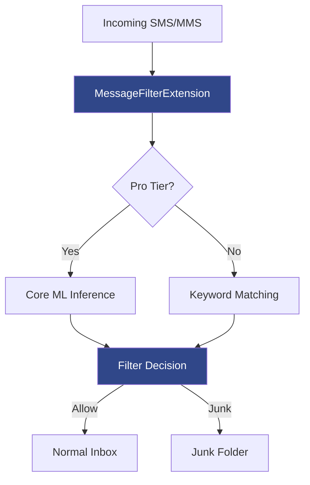

# Privacy Architecture

ElectionDeflection is built on a simple principle: **your messages never leave your device**.

This document explains exactly how the app works, what data stays on your device, and how you can verify every claim yourself.

## Zero Network Requests

ElectionDeflection makes **no network requests** during filtering operations. The message filter extension — the component that reads your incoming texts — contains zero networking code. No `URLSession`, no `URLRequest`, no HTTP calls of any kind.

The **only** network activity in the entire app is Apple's StoreKit framework, which handles In-App Purchase pricing and transactions. This is managed entirely by Apple's system — ElectionDeflection does not operate its own servers, APIs, or backend services.

| App State | Network Activity |
|-----------|-----------------|
| App launch | None |
| Onboarding | None |
| Message filtering | None |
| Settings | None |
| Upgrade screen | Apple StoreKit (IAP pricing) |
| Purchase flow | Apple StoreKit (transaction) |

## On-Device Processing

All message filtering happens locally inside Apple's [ILMessageFilterExtension](https://developer.apple.com/documentation/identitylookup/ilmessagefilterextension) sandbox. When a text message arrives:

```
Incoming SMS/MMS
    |
    v
MessageFilterExtension (on-device, sandboxed)
    |
    +-- Reads keyword list from local storage (App Groups UserDefaults)
    +-- Loads Core ML model from app bundle (not downloaded)
    |
    +-- Pro tier: ML inference (Core ML, on-device)
    +-- Free tier: Keyword matching (string comparison)
    |
    v
Filter Decision (.allow / .junk)
    |
    v
iOS moves message to Inbox or Junk folder
```

No message content is stored, logged, or transmitted at any point in this process.



### Core ML Model

The ML model (`PoliticalTextClassifier`) is bundled directly in the app binary. It is loaded from the app bundle at runtime using `Bundle.main.url(forResource:)` — no server fetch, no model updates over the network. The model runs inference entirely on-device using Apple's Core ML framework.

### Extension Sandbox

Apple's ILMessageFilterExtension runs in a restricted sandbox. The extension:

- **Can** read configuration from App Groups UserDefaults (filter settings, keyword lists, Pro tier status)
- **Cannot** write data back to the main app
- **Cannot** make network requests
- **Cannot** access other apps' data

This sandbox is enforced by iOS at the operating system level. Even if the extension contained networking code (it doesn't), iOS would block the connections. The sandbox restriction means no message content, sender information, or filter decisions are ever persisted or transmitted.

## What We Store

ElectionDeflection stores a small amount of local configuration data using App Groups UserDefaults. This data stays on your device and is never transmitted.

**Stored locally:**

| Data | Purpose | Where |
|------|---------|-------|
| Filter enabled/disabled | Your preference | App Groups UserDefaults |
| Filter method (AI/Keywords) | Your preference | App Groups UserDefaults |
| Pro tier status | Unlock AI filtering | App Groups UserDefaults |
| Keyword list | Words to filter against | App Groups UserDefaults |
| Onboarding completed | Skip intro on relaunch | App Groups UserDefaults |
| IAP receipt | Purchase verification | Managed by Apple StoreKit |

**Never stored:**

- Message content (texts are processed in memory, then discarded)
- Phone numbers or sender information
- Usage analytics or telemetry
- Device identifiers (IDFA, IDFV, or any unique ID)
- Crash reports
- Location data
- Contacts or address book data

## No Analytics, No Telemetry

ElectionDeflection contains:

- No Firebase
- No Amplitude, Mixpanel, or Segment
- No crash reporting SDK (Crashlytics, Sentry, Bugsnag)
- No ad tracking (AdSupport, AppTrackingTransparency)
- No custom analytics or phone-home code

The app uses Apple's `os.log` framework for local debugging logs during development. These logs are stored only on your device by the operating system and are not accessible to ElectionDeflection or any remote service.

## App Groups Data Flow

The main app and the filter extension share configuration through App Groups — a local, on-device mechanism provided by iOS:

```
Main App (ElectionDeflection)
    |
    +-- User toggles filter on/off
    +-- User selects filter method (AI/Keywords)
    +-- StoreKit validates Pro purchase
    |
    v  (writes to App Groups UserDefaults — local only)

Filter Extension (ElectionDeflectionFilter)
    |
    +-- Reads: filterEnabled, filterMethod, proTierStatus, keywordList
    +-- Cannot write back (iOS sandbox restriction)
```

The extension has **read-only access** to this shared data. It cannot modify settings, increment counters, or write any data back to the main app. This is an iOS platform limitation that we consider a privacy feature — it guarantees that the filter extension's only job is to process messages and return a filter decision.

## Verify It Yourself

ElectionDeflection is open source. You can verify every claim in this document.

### Inspect the Source Code

| Privacy Claim | File to Inspect | What to Look For |
|---------------|-----------------|------------------|
| No networking in filter | `ElectionDeflectionFilter/MessageFilterExtension.swift` | Zero `URLSession`, `URLRequest`, or networking imports |
| On-device ML | `ElectionDeflectionFilter/MessageFilterExtension.swift` | `MLModel(contentsOf:)` loading from bundle, no server fetch |
| Local data only | `Shared/SharedDataManager.swift` | `UserDefaults(suiteName:)` with App Group, no network sync |
| No API keys | `Shared/SharedConstants.swift` | Only local UserDefaults keys, no server URLs |
| StoreKit only | `ElectionDeflection/Services/StoreKitService.swift` | Apple's StoreKit 2 API, no custom server calls |

### Monitor Network Traffic

Use a network proxy to verify zero network requests during filtering:

1. **Install a proxy tool** — [Charles Proxy](https://www.charlesproxy.com) (macOS/iOS), [mitmproxy](https://mitmproxy.org) (free, open source), or Xcode Instruments (Network template)
2. **Configure your iOS device** to route traffic through the proxy
3. **Install the proxy's root certificate** on the device (for HTTPS decryption)
4. **Use the app normally** — launch it, toggle filtering, send test messages from another device
5. **Observe the traffic log** — you should see zero requests from ElectionDeflection during all operations except when viewing the upgrade screen (StoreKit loads IAP pricing from Apple)

**Expected results:**
- App launch: zero requests
- Onboarding flow: zero requests
- Filtering active (receive messages): zero requests
- Settings: zero requests
- Upgrade screen: requests to `*.apple.com` only (Apple StoreKit)

## Questions?

If you have questions about ElectionDeflection's privacy architecture, you can:

- [Open an issue](https://github.com/MillerMedia/ElectionDeflection/issues) on GitHub
- Review the [complete source code](https://github.com/MillerMedia/ElectionDeflection)
